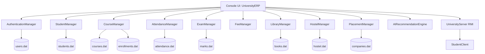

# AI-Powered Distributed University ERP

An object-oriented Java console application for managing core university operations such as students, courses, attendance, examinations, fees, hostel, library, placements, authentication, background notifications, and a small RMI service.

The current project is best understood as a university ERP backend plus a basic terminal UI. Several modules exist in code, but only a smaller set is exposed in the main menu.

## Table of Contents

- [Quick Start](#quick-start)
- [Command Center](#command-center)
- [Project Snapshot](#project-snapshot)
- [Architecture Map](#architecture-map)
- [Requirements](#requirements)
- [Build Commands](#build-commands)
- [Interactive Execution Flow](#interactive-execution-flow)
- [UI Integration Status](#ui-integration-status)
- [RMI Execution](#rmi-execution)
- [Data Files](#data-files)
- [Available Modules](#available-modules)
- [Known Problems and Lacking Areas](#known-problems-and-lacking-areas)
- [Troubleshooting](#troubleshooting)
- [Recommended Improvements](#recommended-improvements)

---

## Quick Start

Run these commands from the project root:

```bash
cd /Users/adityajoshi/Desktop/com
mkdir -p out
javac -d out $(find university -name "*.java")
java -cp out com.university.main.UniversityERP
```

Default admin login:

```text
Username: admin
Password: admin123
```

Seeded student login:

```text
Username: alice
Password: pass
```

To stop the program:

```text
Press Ctrl+C
```

There is no proper Exit option yet, so Ctrl+C is currently required.

---

## Command Center

Use these collapsible command blocks as a copy-paste runbook.

<details>
<summary>Fresh compile and run on macOS/Linux</summary>

```bash
cd /Users/adityajoshi/Desktop/com
rm -rf out
mkdir -p out
javac -d out $(find university -name "*.java")
java -cp out com.university.main.UniversityERP
```

</details>

<details>
<summary>Fresh compile and run on Windows PowerShell</summary>

```powershell
cd "C:\path\to\com"
Remove-Item -Recurse -Force out -ErrorAction SilentlyContinue
New-Item -ItemType Directory -Force out
Get-ChildItem -Recurse -Filter *.java university | ForEach-Object { $_.FullName } > sources.txt
javac -d out @sources.txt
java -cp out com.university.main.UniversityERP
```

</details>

<details>
<summary>Run RMI client after the ERP is running</summary>

```bash
cd /Users/adityajoshi/Desktop/com
java -cp out com.university.rmi.client.StudentClient
```

</details>

<details>
<summary>Create and run an executable JAR</summary>

```bash
cd /Users/adityajoshi/Desktop/com
rm -rf out university-erp.jar
mkdir -p out
javac -d out $(find university -name "*.java")
jar --create --file university-erp.jar --main-class=com.university.main.UniversityERP -C out .
java -jar university-erp.jar
```

</details>

<details>
<summary>Reset demo data</summary>

macOS/Linux:

```bash
cd /Users/adityajoshi/Desktop/com
rm -f *.dat
```

Windows PowerShell:

```powershell
Remove-Item *.dat -ErrorAction SilentlyContinue
```

</details>

<details>
<summary>IDE run configuration</summary>

Use these values in IntelliJ IDEA, Eclipse, VS Code, or NetBeans:

```text
Main class: com.university.main.UniversityERP
Classpath/module output: out
Working directory: /Users/adityajoshi/Desktop/com
```

If the IDE asks for a source root, use the project folder that contains `university/`.

</details>

---

## Project Snapshot

```text
university/
  ai/                 AI-style recommendation and risk heuristics
  attendance/         Attendance records and attendance percentage updates
  authentication/     Login, users, sessions, roles
  core/               Base person model
  courses/            Course creation, faculty assignment, enrollments
  examination/        Marks upload, GPA calculation, result generation
  exceptions/         Custom checked exceptions
  faculty/            Faculty records
  fees/               Fee payment and receipt logic
  hostel/             Hostel room allocation
  interfaces/         Shared contracts
  library/            Book and issue record handling
  main/               Main console application entry point
  models/             Student, Course, Book, Faculty, Admin, Room, Company
  placement/          Company registration and eligibility checks
  reports/            Student report generation
  rmi/                Java RMI server, client, and shared service interface
  students/           Student CRUD/search/sort logic
  threads/            Background attendance, fee, and notification threads
  utils/              File serialization helper
```

Main class:

```text
com.university.main.UniversityERP
```

Optional RMI client class:

```text
com.university.rmi.client.StudentClient
```

---

## Architecture Map



Runtime idea:

```text
User
  -> Terminal Menu
    -> Managers
      -> Serialized .dat files

Optional RMI Client
  -> RMI Server on localhost:1099
    -> Managers
      -> Serialized .dat files
```

---

## Requirements

You need the JDK, not only the JRE.

Recommended:

```text
Java 17 or newer
```

Tested successfully with:

```text
javac 21.0.11
OpenJDK 21.0.11
```

Check your Java setup:

```bash
javac -version
java -version
```

If `javac` is missing, install a JDK.

---

## Build Commands

### macOS / Linux

Clean old compiled files:

```bash
rm -rf out
```

Compile:

```bash
mkdir -p out
javac -d out $(find university -name "*.java")
```

Run:

```bash
java -cp out com.university.main.UniversityERP
```

### Windows PowerShell

Clean old compiled files:

```powershell
Remove-Item -Recurse -Force out -ErrorAction SilentlyContinue
```

Compile:

```powershell
New-Item -ItemType Directory -Force out
Get-ChildItem -Recurse -Filter *.java university | ForEach-Object { $_.FullName } > sources.txt
javac -d out @sources.txt
```

Run:

```powershell
java -cp out com.university.main.UniversityERP
```

---

## Interactive Execution Flow

When the app starts, you should see output similar to:

```text
Starting AI-Powered Distributed University ERP...
[AttendanceThread] Checking for low attendance...
[FeeProcessingThread] Processing pending fees...
University RMI Server is running...

--- LOGIN ---
Username:
```

Login as admin:

```text
Username: admin
Password: admin123
```

Admin menu:

```text
--- ADMIN DASHBOARD ---
1. Add Student
2. View All Students
3. AI: Detect At-Risk Students
4. Logout
Choice:
```

Try this simple demo path:

```text
admin
admin123
2
4
Ctrl+C
```

Expected result for option `2`:

```text
Student Profile:
ID: S101
Name: Alice
Email: alice@univ.edu
Department: CS
Semester: 1
CGPA: 8.5
Attendance: 85.0%
```

---

## UI Integration Status

### Current UI

The current user interface is a terminal-based menu system inside:

```text
university/main/UniversityERP.java
```

It supports:

| Role | Current menu features |
| --- | --- |
| Admin | Add student, view students, detect at-risk students, logout |
| Faculty | Logout only |
| Student | Placeholder profile view, logout |

### Suggested UI Integration

The backend managers are already separated enough that a better UI can be added later. Recommended UI options:

| UI Type | Best for | Notes |
| --- | --- | --- |
| Java Swing | Simple desktop GUI | No external server needed |
| JavaFX | Modern Java desktop GUI | Cleaner UI, but needs JavaFX setup |
| Web UI + REST API | Best long-term choice | Requires adding an HTTP layer such as Spring Boot |
| Improved Console UI | Fastest improvement | Add full menus for all existing managers |

Recommended future structure:

```text
UI Layer
  -> Admin Dashboard
  -> Faculty Dashboard
  -> Student Dashboard

Service Layer
  -> StudentManager
  -> CourseManager
  -> AttendanceManager
  -> ExamManager
  -> FeeManager
  -> LibraryManager
  -> HostelManager
  -> PlacementManager

Storage Layer
  -> Serialized .dat files, or later a database
```

The easiest next UI upgrade is to expand the existing console menus before introducing Swing, JavaFX, or a web app.

### Console UI Wireframe

Current UI:

```text
+--------------------------------------------------+
| AI-Powered Distributed University ERP            |
+--------------------------------------------------+
| LOGIN                                            |
| Username:                                        |
| Password:                                        |
+--------------------------------------------------+
        |
        v
+----------------------+  +----------------------+  +----------------------+
| Admin Dashboard      |  | Faculty Dashboard    |  | Student Dashboard    |
| 1. Add Student       |  | 1. Logout            |  | 1. View Profile      |
| 2. View Students     |  |                      |  | 2. Logout            |
| 3. AI Risk Detection |  | Lacking features     |  | Profile incomplete   |
| 4. Logout            |  |                      |  |                      |
+----------------------+  +----------------------+  +----------------------+
```

Recommended future UI:

```text
+----------------------+  +----------------------+  +----------------------+
| Admin Dashboard      |  | Faculty Dashboard    |  | Student Dashboard    |
| Students             |  | Attendance           |  | Profile              |
| Faculty              |  | Marks Upload         |  | Attendance           |
| Courses              |  | Course Students      |  | Results              |
| Library              |  | Reports              |  | Fees                 |
| Hostel               |  | Notifications        |  | Library              |
| Placements           |  |                      |  | Placements           |
| Reports              |  |                      |  |                      |
+----------------------+  +----------------------+  +----------------------+
```

---

## RMI Execution

The main ERP automatically starts an RMI server on port `1099`.

To test the RMI client, use two terminals.

Terminal 1:

```bash
cd /Users/adityajoshi/Desktop/com
java -cp out com.university.main.UniversityERP
```

Terminal 2:

```bash
cd /Users/adityajoshi/Desktop/com
java -cp out com.university.rmi.client.StudentClient
```

Expected RMI client output:

```text
Connected to University Server via RMI.
```

If port `1099` is already busy on macOS/Linux:

```bash
lsof -i :1099
```

Then stop the process using that port, or change the RMI port in:

```text
university/rmi/server/UniversityServer.java
```

---

## Data Files

The app stores data using Java object serialization in `.dat` files in the directory where you run the app.

Common files:

```text
users.dat
students.dat
courses.dat
enrollments.dat
attendance.dat
marks.dat
faculty.dat
books.dat
issues.dat
hostel.dat
companies.dat
```

Reset all local app data:

```bash
rm -f *.dat
```

Then rerun:

```bash
java -cp out com.university.main.UniversityERP
```

This recreates the default admin user and seeded demo data.

Important: because the data files are created relative to the current terminal directory, running the app from a different folder can create a separate set of `.dat` files.

---

## Available Modules

| Module | Status | Description |
| --- | --- | --- |
| Authentication | Partially exposed | Admin and student login works through serialized users |
| Session Management | Exposed | Tracks active user session |
| Student Management | Partially exposed | Add student and view students are in admin menu |
| Course Management | Backend only | Add courses, enroll/drop students, assign faculty |
| Faculty Management | Backend only | Add, remove, search, sort faculty |
| Attendance | Backend plus thread | Mark attendance and update attendance percentage |
| Examination | Backend only | Upload marks and generate result text |
| Fees | Backend plus thread | Process fee payments and generate receipts |
| Library | Backend only | Add, borrow, return, and search books |
| Hostel | Backend only | Add rooms, allocate/vacate rooms, print occupancy |
| Placement | Backend plus RMI usage | Register companies and check eligible students |
| Reports | Backend only | Generate overall student report |
| AI Engine | Partially exposed | Detect at-risk students from attendance and CGPA |
| RMI Server | Auto-started | Exposes student, attendance, library, and placement checks |
| RMI Client | Demo only | Connects to the RMI server |
| Background Threads | Auto-started | Attendance check, fee reminder, notification queue |

---

## Known Problems and Lacking Areas

This is the most important section if you are submitting or improving the project.

1. No full graphical UI

   The project currently uses a console menu. It does not have a Swing, JavaFX, or web dashboard.

2. Many backend modules are not connected to menus

   Course, faculty, library, hostel, attendance, examination, fee, placement, and report features exist in code, but most are not reachable from the main UI.

3. No graceful exit option

   The main loop runs forever. Users must stop the app with `Ctrl+C`.

4. Faculty and student dashboards are incomplete

   Faculty can only logout. Student profile says `Profile logic here...` instead of showing real session-linked student details.

5. Authentication is not secure

   Passwords are stored in serialized files without hashing. This is acceptable for a classroom demo, but not for real software.

6. File storage is fragile

   Java serialization `.dat` files are easy for demos, but they are not a good production database. Class changes can break old data files.

7. No real database

   There is no MySQL, PostgreSQL, SQLite, or MongoDB integration.

8. No test suite

   There are no automated unit tests or integration tests.

9. No build tool

   The project does not use Maven or Gradle, so dependencies, testing, packaging, and running are manual.

10. RMI port is hard-coded

    The RMI server always uses port `1099`. If the port is busy, the app prints an exception.

11. AI is heuristic, not real machine learning

    The AI module uses simple rules based on CGPA and attendance. It does not train a model or use historical datasets.

12. Weak validation

    Several inputs are accepted directly. Duplicate IDs can overwrite records, and fields like email, semester, phone, and marks need stronger validation.

13. No authorization checks inside managers

    Roles exist in the login system, but the lower-level manager classes do not enforce permissions themselves.

14. RMI client is only a connection demo

    The client connects successfully, but its sample service calls are commented out.

15. Background threads print into the same console

    Attendance and fee threads can print messages while the user is typing, which can make the terminal UI messy.

---

## Troubleshooting

### `javac: command not found`

Install a JDK, then verify:

```bash
javac -version
```

### `Could not find or load main class`

Make sure you compiled with `-d out` and used the full package name:

```bash
javac -d out $(find university -name "*.java")
java -cp out com.university.main.UniversityERP
```

### Login fails

Reset the serialized data files:

```bash
rm -f *.dat
java -cp out com.university.main.UniversityERP
```

Then use:

```text
admin / admin123
```

### RMI server fails

Port `1099` may already be in use.

```bash
lsof -i :1099
```

Stop the conflicting process or change the port in the RMI server and client.

### Data disappeared

Make sure you are running from the same project root each time:

```bash
cd /Users/adityajoshi/Desktop/com
```

The `.dat` files are relative to the current directory.

---

## Recommended Improvements

Best next steps:

1. Add a real Exit option.
2. Connect all existing managers to the console UI.
3. Replace `Profile logic here...` with real student profile lookup.
4. Add faculty features such as upload marks and mark attendance.
5. Add student features such as view profile, view marks, view attendance, view fees, and view enrolled courses.
6. Add a simple Swing or JavaFX dashboard.
7. Move data storage from `.dat` files to SQLite or MySQL.
8. Hash passwords before saving them.
9. Add Maven or Gradle.
10. Add JUnit tests.
11. Make RMI host and port configurable.
12. Add proper input validation and duplicate-record checks.

---

## One-Command Local Demo

Use this when you just want to compile and launch quickly:

```bash
cd /Users/adityajoshi/Desktop/com
rm -rf out
mkdir -p out
javac -d out $(find university -name "*.java")
java -cp out com.university.main.UniversityERP
```

Then login:

```text
admin
admin123
```

---

## Submission Notes

If this is being submitted as a university project, mention clearly that:

```text
The project demonstrates Java OOP, packages, inheritance, interfaces, exceptions,
collections, file handling, multithreading, Java RMI, and a basic terminal UI.
```

Also mention clearly that:

```text
The current version is a prototype/demo and not production-ready because it lacks
a complete UI, secure authentication, database storage, tests, and complete menu
integration for all modules.
```
